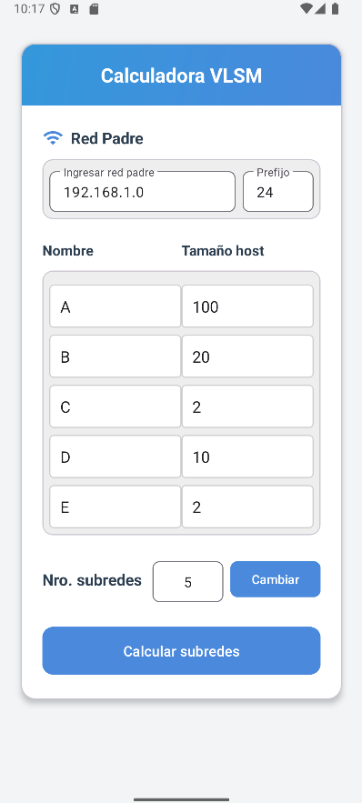
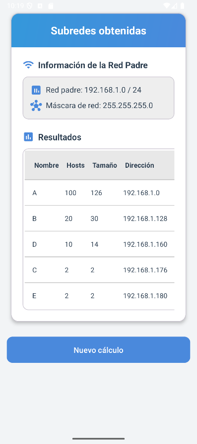

# Calculadora VLSM para Android

[//]: # ([![Build Status]&#40;https://img.shields.io/badge/Build-Pasando-brightgreen.svg&#41;]&#40;https://example.com/build-status&#41; [![License]&#40;https://img.shields.io/badge/Licencia-MIT-yellow.svg&#41;]&#40;https://opensource.org/licenses/MIT&#41; ## Descripción General)

Esta es una aplicación para Android diseñada para ayudar con los cálculos de Máscara de Subred de Longitud Variable (VLSM). Permite a los usuarios ingresar una red padre, especificar el número de subredes requeridas y el número de hosts necesarios para cada una, y luego calcula los detalles de la subred.
Este es un port de la siguiente aplicación web: https://calculadoravlsm.neocities.org/ 

## Capturas de Pantalla


<br>
<br>

<br>
<br>

## Uso Básico

Guía paso a paso sobre cómo usar la aplicación Calculadora VLSM:

1.  **Ingrese la Red Padre:** En el campo "Red Padre", ingrese la dirección IP de la red principal que desea subredear. Por ejemplo, `192.168.1.0`.

2.  **Ingrese el Prefijo:** En el campo "Prefijo", ingrese el prefijo CIDR de la red padre. Por ejemplo, `24`.

3.  **Especifique el Número de Subredes:** En el campo "Nro. subredes", ingrese el número total de subredes que necesita crear.

4.  **Defina los Requisitos de las Subredes:**
    * Después de ingresar el número de subredes, la aplicación mostrará una lista de filas de subredes (inicialmente 5, pero puede cambiar el número presionando el botón "Cambiar").
    * Para cada subred, debe proporcionar:
        * **Nombre:** Ingrese un nombre o identificador para la subred (por ejemplo, A, B, C o un nombre descriptivo).
        * **Tamaño host:** Ingrese el número de hosts utilizables requeridos para esta subred específica.

5.  **Calcular Subredes:** Una vez que haya ingresado la información de la red padre, el prefijo y los requisitos de host para cada subred, haga clic en el botón **"Calcular subredes"**.

6.  **Ver Resultados:** La aplicación navegará a una nueva pantalla (Actividad de Salida) donde mostrará una tabla con los detalles de cada subred calculada, incluyendo:
    * Nombre de la Subred
    * Número de Hosts Requeridos
    * Número de Hosts Asignados
    * Dirección de Subred
    * Prefijo
    * (Más detalles como Dirección Binaria, Máscara, Rango y Broadcast son visibles en modo horizontal)

**Nota Importante:** La aplicación realizará una verificación para asegurarse de que el número total de hosts solicitados no exceda la capacidad de la red padre según el prefijo proporcionado. Si el requisito total de hosts es demasiado grande, la aplicación mostrará un mensaje de error y evitará el cálculo.

## Primeros Pasos (Para Desarrolladores)

Pasos para construir y ejecutar esta aplicación desde el código fuente:

1.  **Clonar el repositorio:**
    ```bash
    git clone [https://github.com/TuNombreDeUsuario/CalculadoraVLSM-Android.git](https://github.com/Diret03/CalculadoraVLSM-Android.git)
    ```

2.  **Abrir el proyecto en Android Studio.**

3.  **Construir y ejecutar la aplicación en un emulador o dispositivo Android físico.**


## Autor

Este proyecto ha sido desarrollado por:

[Diret] ([https://github.com/Diret03](https://github.com/TuNombreDeUsuario)) ```
